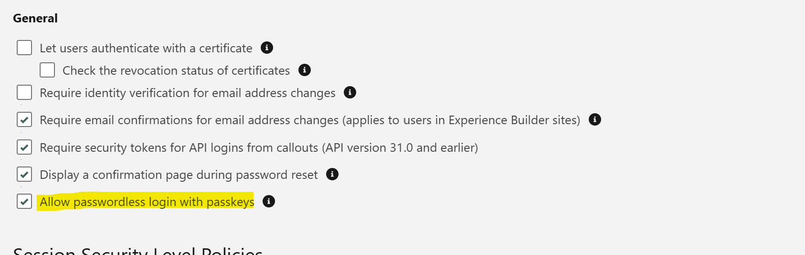
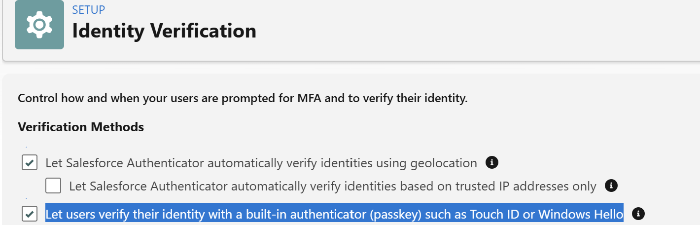
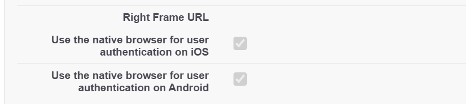

# Phishing-Resistant MFA in Salesforce — Mobile & Cross-Device Setup Guide

Salesforce is rolling out mandatory **phishing-resistant Multi-Factor Authentication (MFA)** for privileged users, including those assigned the **System Administrator** profile or permissions such as:

* Modify All Data
* View All Data
* Customize Application
* Author Apex

> **Update:** Salesforce has revised the enforcement dates. Phishing-resistant MFA is now scheduled for **22 July 2026**. Since Salesforce has updated these dates multiple times, always verify the latest timeline in the official Salesforce documentation before planning your rollout.

Salesforce's documentation covers the desktop/browser enrollment process reasonably well but provides limited guidance on **mobile enrollment**, particularly around the differences between iOS and Android. This guide documents the approach we successfully used during rollout.

---

# What qualifies as phishing-resistant MFA?

The following authentication methods satisfy Salesforce's phishing-resistant MFA requirement:

* Built-in device authenticators (Windows Hello, Touch ID, Face ID)
* Hardware security keys (for example, YubiKey)
* Passkeys (FIDO2/WebAuthn)

The following **do not** satisfy the requirement:

* SMS verification codes
* Email one-time passwords (OTP)
* Salesforce Authenticator push notifications
* TOTP applications such as Google Authenticator or Microsoft Authenticator

---

# Recommended Configuration

To avoid account lockouts, register **at least two phishing-resistant authentication methods** for every privileged user.

I adopted the following standard configuration for my clients:

* **Primary:** Windows Hello (desktop/laptop)
* **Secondary:** Mobile device passkey (iPhone or Android)

This provides users with a backup authentication method if their primary device is unavailable.

---

# Step 1 — Enable Built-In Authenticators (Administrator)

Before users can enroll passkeys, ensure the following settings are enabled:

1. Navigate to:

   **Setup → Identity Verification**

2. Enable:

   * **Let users verify their identity with a built-in authenticator (passkey), such as Touch ID or Windows Hello**
   * **Allow passwordless login with passkeys**

---

# Step 2 — Enroll Windows Hello (Desktop)

On a Windows device with Windows Hello already configured:

1. Sign in to Salesforce.

2. Navigate to:

   **Avatar → Settings → My Personal Information → Advanced User Details**

3. Click **Add** next to **Built-In Authenticator**.

4. Verify using Windows Hello (fingerprint, facial recognition, or PIN).

5. Give the authenticator a meaningful name, such as:

   **Work Laptop – Windows Hello**

At this stage, desktop users can authenticate using Windows Hello.

---

# Optional Configuration for Organizations Using the Salesforce Mobile App

If users will access Salesforce from mobile devices, enable the following settings:

Navigate to:

**Setup → My Domain**

Scroll to the **Authentication Configuration** section and enable:

* **Use the native browser for user authentication on iOS**
* **Use the native browser for user authentication on Android**

These settings allow the Salesforce mobile app to authenticate using the device's native passkey support.

---

# Step 3 — Register a Mobile Passkey

After Windows Hello has been enrolled, register a passkey on the user's mobile device.

1. Follow the first three steps from **Step 2**.

2. Instead of creating another Windows Hello credential, click **Change**.

3. Select:

   * iPhone or iPad or Android device

4. Salesforce displays a QR code.

5. Ensure **Bluetooth is enabled on both the computer and the mobile device**, as nearby device communication is required.

6. Scan the QR code using the mobile device.

7. Follow the prompts on the phone to authenticate using Face ID, Touch ID, fingerprint, or device PIN.

The passkey is now securely stored on the mobile device and can be used to authenticate future Salesforce logins.

---

# Signing in to Salesforce from the Mobile App

Once the passkey has been registered:

1. Open the **Salesforce mobile app**.

2. On the login screen, tap the **Settings** icon.

3. Select **Servers** (or **Networks**, depending on your app version).

4. Tap the **+** icon to add a new server.

5. Enter your Salesforce My Domain URL, for example:

   `company.my.salesforce.com`

6. Return to the login screen.

7. When prompted, approve the sign-in request.

8. Enter your Salesforce username.

9. Select **Remember Me**, then tap **Log In**.

10. When prompted to verify your identity, authenticate using your device's built-in authenticator (Face ID, Touch ID, fingerprint, or device PIN).

Salesforce uses the passkey stored on the mobile device to complete authentication without requiring a password.

> **Note:** Your organization's login URL must use the **my.salesforce.com** domain.

---

# Cross-Device Sign-In

Once a passkey has been saved on your mobile device, it can also be used to authenticate sign-ins on another computer.

When logging in from a new desktop or laptop:

1. Choose **Use another device** during passkey authentication.
2. Scan the QR code displayed on the computer using your mobile device.
3. Approve the authentication using Face ID, Touch ID, fingerprint, or device PIN.

This allows users to securely authenticate even when their passkey is stored only on their phone.